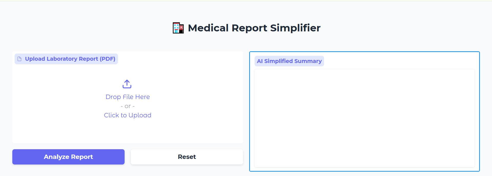
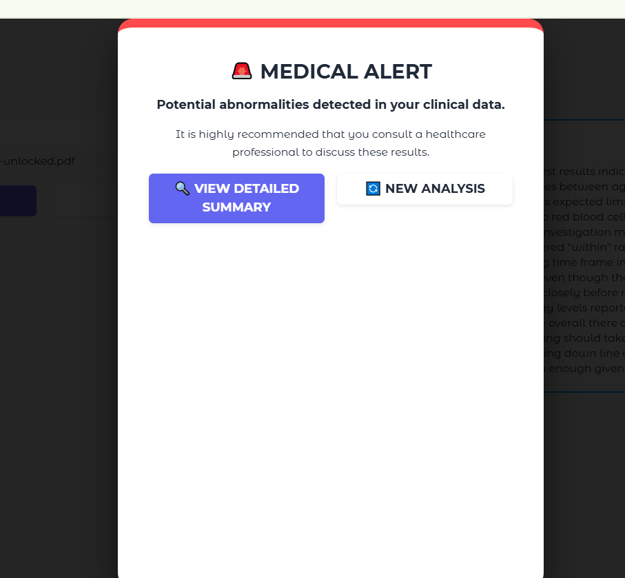
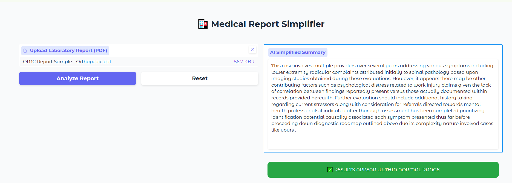

# 🩺 Medical Report Simplifier

An LLM-powered tool that automatically extracts key clinical information from complex pathology reports and translates them into simplified, patient-friendly summaries — built by fine-tuning Mistral-7B using QLoRA on medical instruction data.

*Upload interface — drop a lab/pathology report PDF and click "Analyze Report"*

| Alert Case | Normal-Range Case |
|---|---|
|  |  |
| Flags potential abnormalities and recommends consulting a healthcare professional | Confirms results appear within normal range, alongside the plain-language summary |
## 🔍 Project Overview

Pathology support teams routinely spend hours manually simplifying dense, technical medical reports for patients. This project automates that process end-to-end: extracting key clinical information from raw PDF reports and generating clear, accurate, patient-readable summaries — without sacrificing clinical fidelity.

## 🎯 Results

- Automated extraction of key clinical information from **50+ complex medical reports**, saving an estimated **10 hours per week** for the pathology support team
- Successfully condensed **15+ page pathology reports** into short, patient-friendly summaries
- Achieved a structural accuracy score of **0.5476 (ROUGE-L)** by fine-tuning on the specialized **MedText** instruction dataset, maintaining high clinical fidelity to the source reports
- Used **4-bit quantization (QLoRA)** to make fine-tuning and inference feasible on limited hardware, without a significant accuracy trade-off
- Built a risk-flagging layer that classifies each report as within normal range or requiring medical attention, giving patients an immediate, clear signal alongside the detailed summary

## 🛠️ Tech Stack

- **Model:** Mistral-7B, fine-tuned with QLoRA (4-bit quantization)
- **Training framework:** Unsloth (for memory-efficient fine-tuning), PyTorch, Hugging Face Transformers
- **Data extraction:** pdfplumber (parsing raw PDF pathology reports)
- **Evaluation:** Scikit-learn, ROUGE-L scoring
- **Interface:** Gradio (interactive demo for uploading a report and viewing the simplified output)

## ⚙️ How It Works

1. **Input** — A complex, multi-page pathology/medical report (PDF) is uploaded
2. **Extraction** — `pdfplumber` parses and extracts raw text from the report
3. **Simplification** — The fine-tuned Mistral-7B model generates a simplified, patient-friendly summary, trained specifically to preserve clinically important details while removing jargon
4. **Risk flagging** — The output is classified as either within normal range or flagged with a medical alert recommending professional consultation, giving the patient an immediate, clear signal alongside the detailed summary
5. **Output** — The simplified summary and risk flag are displayed through a Gradio interface for immediate review

## 📂 Repository Contents

| File/Folder | Description |
|---|---|
| `medical_report_simplifier.ipynb` | Full notebook — data prep, fine-tuning, evaluation, and inference pipeline |
| `requirements.txt` | Python dependencies to reproduce the environment |
| `sample_outputs/` | Example before/after report simplification (synthetic/anonymized data only) |
| `screenshots/` | Interface screenshots |

**Note:** Model weights are not hosted in this repository due to file size. [Link to Hugging Face model, if uploaded]

## 🚀 How to Use

1. Clone this repo: `git clone https://github.com/kirti-sharma15/medical-report-simplifier.git`
2. Install dependencies: `pip install -r requirements.txt`
3. Open `medical_report_simplifier.ipynb` in Jupyter or Google Colab
4. Run all cells to launch the Gradio interface and test with a sample report

## ⚠️ Data & Privacy Note

All sample reports included in this repository are synthetic or fully anonymized for demonstration purposes only. No real patient data is stored or shared in this repository.

---

*Built as part of a data analytics portfolio project exploring applied LLM fine-tuning for real-world document simplification.*
